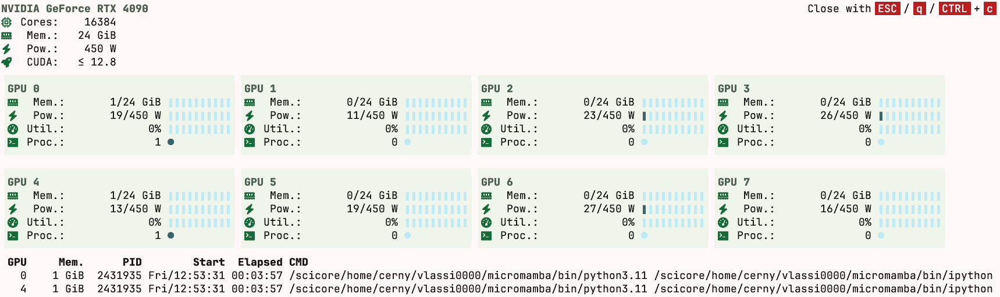
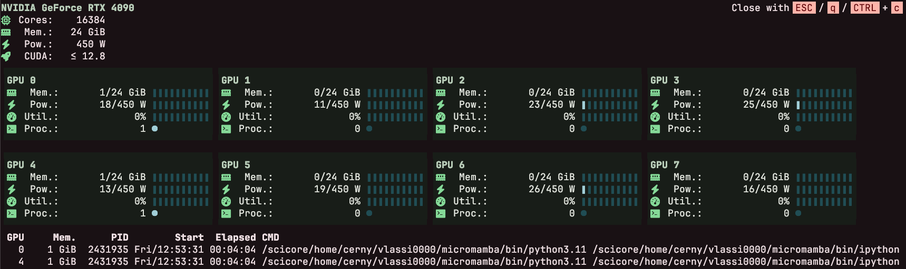

# gvtop

## Description
`nvidia-smi` looks sad without colors 😢. If you do not want to be sad, try `gvtop` instead (FDA approved). `gvtop` is a monitoring tool for NVIDIA GPUs with *real* Material You colors. A lot of "Material Design" programs out there are rather "Material *inspired*", in the sense that they use color palettes that resemble but not exactly coincide with official ones. In contrast, `gvtop` uses real Material Design palettes, created by [m3](https://github.com/gvlassis/m3) (frontend for [material-color-utilities
](https://github.com/material-foundation/material-color-utilities)). And like a real Material You application, `gvtop` is adaptable - it reacts to light/dark mode and has multiple (20) [color themes](./res/).

TLDR:
1) Auto light/dark mode in the terminal via [`CSI?996n`](https://contour-terminal.org/vt-extensions/color-palette-update-notifications/) 
2) 20 bedazzling [color themes](./res/)
3) Zero flickering via [Synchronized Update](https://gitlab.com/gnachman/iterm2/-/wikis/synchronized-updates-spec)
4) Inappropriate compliments when exiting
   
## Usage
1)  Install from GitHub via pip:

        pip install git+https://github.com/gvlassis/gvtop

2)  Profit:

        gvtop

